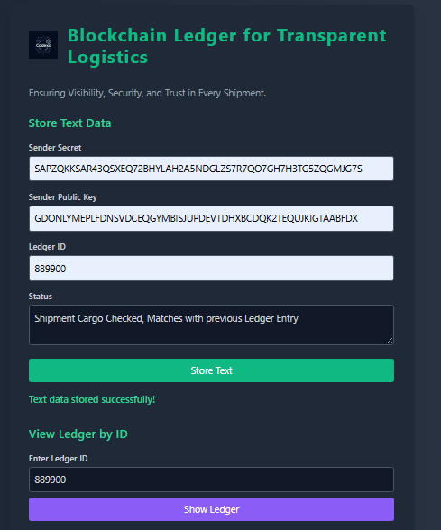

# CargoLedger

CargoLedger leverages blockchain technology to authenticate and monitor cargo throughout its journey. By storing cargo details on the Diamante blockchain, it ensures data integrity, accessibility, and immutability, which are essential for reliable cargo verification.

## Features
**Decentralized Ledger**: Ensures secure and immutable record-keeping.

**Cargo Tracking**: Logs and retrieves cargo information with ease.

## Prerequisites
Node.js (v14 or higher recommended)

Diamante Blockchain testnet account and secret key

Dependencies (managed through npm)

## Installation
### Clone the Repository:

bash

    git clone https://github.com/pranabbhardwaj137/CODEXO_CargoLedger.git
    cd CargoLedger_Main
### Install Dependencies:

bash

    npm install

***Set up Diamante Testnet: Obtain a Diamante testnet account with a valid secret key to interact with the blockchain.***

### Running the Project
#### To start the project server:

bash

    node index.js
***The server will start on http://localhost:3001 by default. You can adjust the port by setting the PORT environment variable.***

#### Project Structure
**index.js**: Main server file initializing the Express app and defining routes.

**server.js**: Server setup and configuration.

**CargoLedger_Main**: Folder containing the core logic for blockchain interactions.

## Usage
### Adding a Cargo Record
Used to record cargo information on the Diamante blockchain. This ensures that cargo details are securely stored and can be tracked at any point.

### Retrieving a Cargo Record
Allows users to fetch cargo details based on a public key and cargo ID. This is useful for validating the cargo's origin and ensuring it has not been tampered with.

### Contributing
Feel free to open issues or submit pull requests. We welcome contributions that improve the security, functionality, or efficiency of the CargoLedger.

